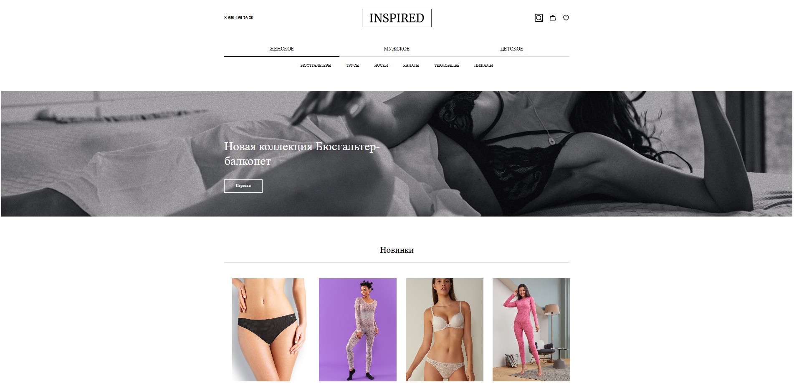
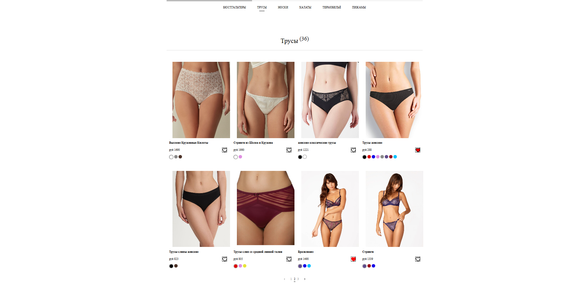
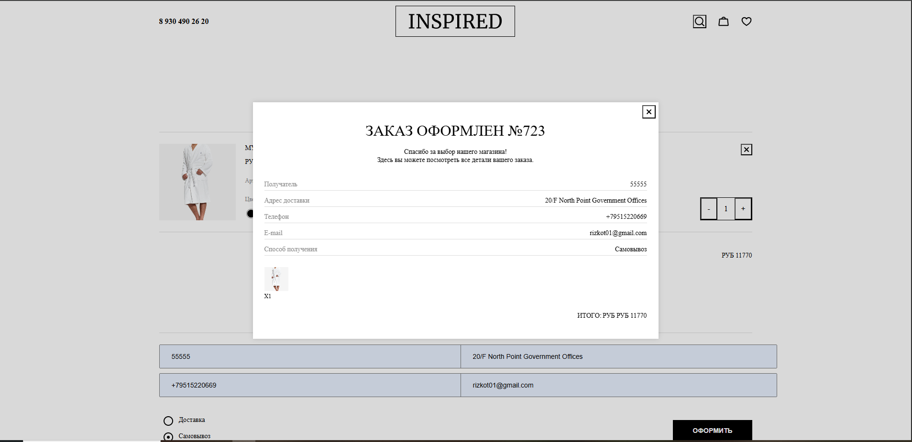
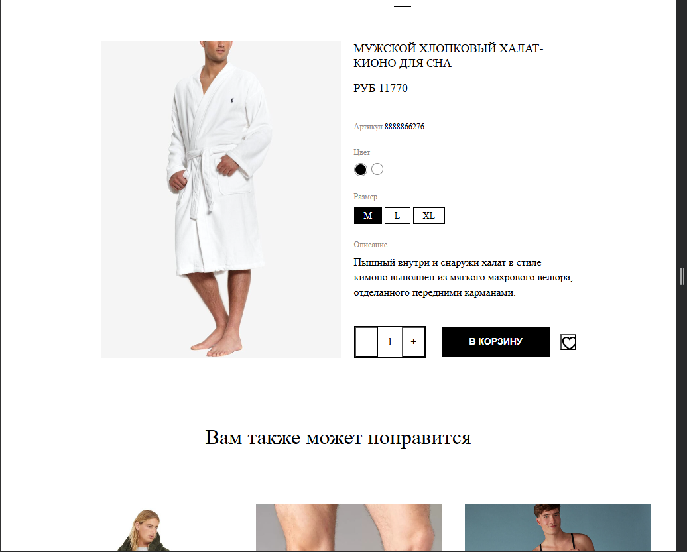
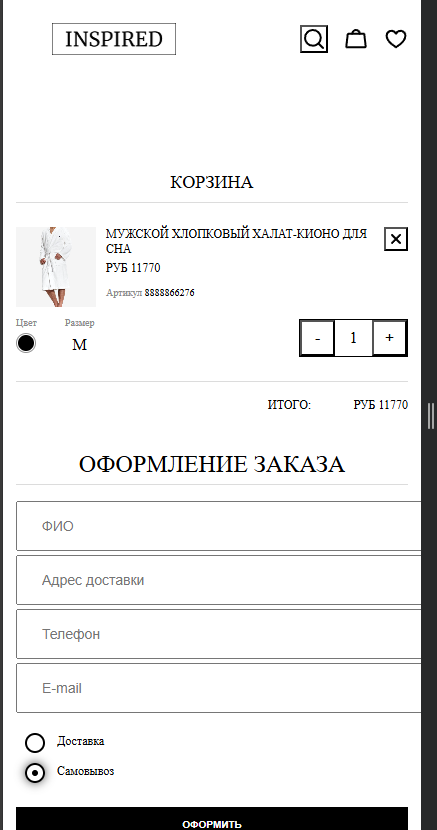

# Inspired Store SPA

Frontend e-commerce SPA built with Vanilla JavaScript.


The project demonstrates a complete online store interface including product catalog, product page, cart management and checkout flow.

The entire interface is dynamically generated with JavaScript without using static HTML templates.  
The application follows a modular SPA architecture with client-side routing.

---

## Features

- SPA architecture
- client-side routing using **Navigo**
- dynamic UI rendering with JavaScript
- product catalog with pagination
- category filtering (women / men / kids)
- search by product name and description
- product detail page
- color selection
- size selection
- shopping cart
- quantity management
- favorites
- checkout form
- order confirmation modal
- responsive layout (desktop / tablet / mobile)
- cart state stored in **LocalStorage**
- product data loaded via API

---

## Architecture

The project is organized using a modular structure:

src
├── controllers # application logic
├── render # UI rendering modules
├── utils # helper functions
├── getData # API requests
├── const # constants and configuration
└── mainPage # main page components


This structure separates application logic, rendering modules and utilities,
making the project easier to scale and maintain.

Typical user interaction flow in the application:


Catalog
↓
Product Page
↓
Select Size / Color
↓
Add to Cart
↓
Cart
↓
Checkout
↓
Order Confirmation


The interface is rendered using a custom DOM helper function that simplifies element creation and component composition.

Example helper:

```javascript
export const createElement = (tag, attr, {append, appends, parent, cb} = {} ) => {
    const element = document.createElement(tag);

    if (attr) {
        Object.assign(element, attr)
    }

    if (append && append instanceof HTMLElement) {
        element.append(append)
    }

    if (appends && appends.every(item => item instanceof HTMLElement)) {
        element.append(...appends)
    }

    if (parent && parent instanceof HTMLElement) {
        parent.append(element)
    }

    if (cb && typeof cb === 'function') {
        cb(element)
    }

    return element
}
Tech Stack

Vanilla JavaScript

Webpack

SCSS

Navigo (client-side router)

LocalStorage

REST API

Responsive Design

The application is fully responsive and optimized for multiple screen sizes.

Desktop

Full catalog layout with filters, product cards and cart.

Tablet

Grid layout adapts to medium screens while keeping usability and readability.

Mobile

Vertical interface layout optimized for smaller screens while maintaining full functionality.

Project Purpose

This project demonstrates:

building SPA applications without frameworks

modular frontend architecture

dynamic DOM rendering

client-side state management

implementation of a real e-commerce user flow

Installation

Clone the repository:

git clone https://github.com/yourusername/inspired-store-spa.git

## Screenshots

### Desktop




### Tablet


### Mobile


Install dependencies:

npm install

Run development server:

npm run dev

Build production version:

npm run build


Author

Dmitry Vnukov